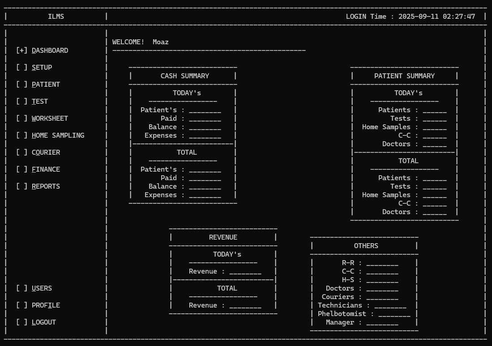

# 🧪 ILMS – Integrated Lab Management System

[](https://github.com/HafizMMoaz/ilms/actions/workflows/build.yml)



A console-based **Integrated Lab Management System** for medical laboratories,
written in C++ and organised with a clean **Model–View–Controller (MVC)**
architecture so the console UI can later be swapped for a GUI.

> Originally a single 4900-line file for **CSC-102 Programming Fundamentals** at
> **UET Lahore**, now refactored into a structured, multi-file OOP project.

---

## ✨ Features

**Setup**
- **Specimens** – add / edit / delete
- **Lab Departments** – add / edit / delete
- **Lab Tests** – name, rate, unit, frequency, delivery time, comments + a
  chosen specimen / department / machine
- **Machines** – add / edit / delete
- **Packages** – bundle 2–5 lab tests at a discounted rate
- **SOPs** – standard operating procedures attached to a specimen (a checklist
  followed when that specimen is collected)
- **Corporate** – referring companies / hospitals / doctors (discount + commission)
- **Test Rate List** – read-only price list

**Patients**
- **Register** – details, sample location, reference company, package *or*
  individual tests, automatic billing & balance
- **Add tests** to an already-registered patient (re-bills automatically)
- **Collect specimens** later, per test — collecting shows that specimen's **SOP
  checklist** and requires the technician to confirm they followed it
- **Patient summary** – totals, specimens collected/pending, billing aggregates

**System**
- **Dashboard** with live summary panels
- **Interactive tables** – per-row Edit/Delete, **search** and **pagination**
- **Audit trail** – every record stores `createdAt` / `updatedAt`; all activity
  is logged to `Database/logs.txt`
- **Admin-only activity log viewer** – view / search / delete (a deletion records
  who cleared it)
- **Timestamped Backup & Restore** – keep multiple backups and choose which to restore

---

## 🛠️ Build & Run

Requires **g++** (MinGW-w64) on Windows.

```bat
build.bat        REM compiles everything into ilms.exe
ilms.exe
```

Or directly:

```
g++ -std=c++17 -Imodel -Iview -Icontroller main.cpp ^
    model\Utils.cpp model\Session.cpp model\Validator.cpp model\Database.cpp ^
    model\Backup.cpp model\Logger.cpp ^
    view\Console.cpp view\ConsoleView.cpp controller\App.cpp -o ilms.exe
```

**Default logins** (seeded in `model/Database.cpp`):

| Username   | Password | Role        |
|------------|----------|-------------|
| `hafiz`    | `1234`   | Receptionist|
| `muhammad` | `5678`   | Manager     |
| `moaz`     | `1452`   | Super Admin |

> The **Activity Logs** menu is visible only to admins (e.g. `moaz`).

---

## 🏗️ Architecture (MVC)

```
main.cpp           Composition root: picks a View, starts the App
model/             Data + rules (records, Repository<T>, Database, Session,
                   Validator, Backup, Logger) — no UI
view/              View interface + ConsoleView (console UI) + Console helpers
controller/        App: application flow; talks only to the model and View
```

The controller depends on the **abstract `View`** interface, so a future GUI
view can replace `ConsoleView` by changing a single line in `main.cpp`.
See [ARCHITECTURE.md](./ARCHITECTURE.md) for details and the recipe for adding
new modules.

---

## 👨‍💻 Author
**Hafiz Muhammad Moaz (2024-CS-23)**
Supervised by **Dr. Awais**
Department of Computer Science
University of Engineering and Technology, Lahore
